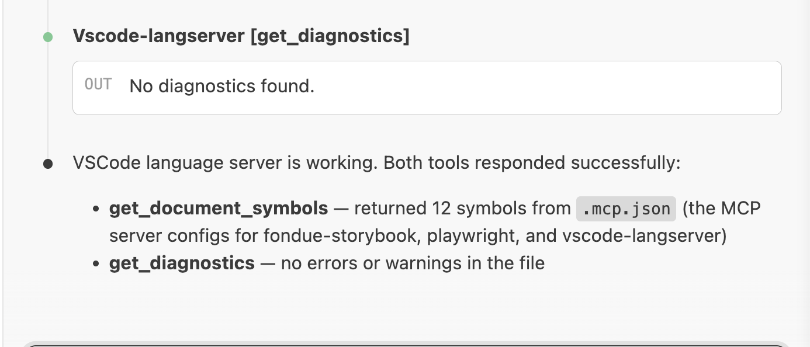
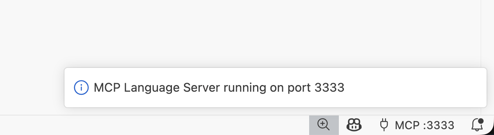

# MCP Language Server Bridge

Expose VS Code's language server features as [MCP](https://modelcontextprotocol.io/) tools — so AI coding agents like Claude Code can access diagnostics, go-to-definition, hover info, code actions, and more.

Works with **any language** that has a VS Code language server (TypeScript, Python, Go, Rust, Java, C/C++, etc.).



## How it works

The extension runs an MCP server inside VS Code over Streamable HTTP. AI agents connect to it and call tools that map directly to VS Code's language server APIs — the same intelligence that powers your editor.

```
AI Agent  ──(Streamable HTTP)──>  VS Code Extension (MCP Server)  ──(VS Code API)──>  Language Servers
```

## Quick start

1. Install the extension
2. The MCP server starts automatically on port `3333`
3. Add the server to your AI agent's MCP config:

```bash
claude mcp add --transport http vscode-langserver http://localhost:3333/mcp
```

Or manually in your `.mcp.json`:

```json
{
  "mcpServers": {
    "vscode-langserver": {
      "url": "http://localhost:3333/mcp"
    }
  }
}
```

You'll see the status in the bottom-right corner of VS Code:



## Available tools

### Read-only

| Tool | Description |
|------|-------------|
| `get_diagnostics` | Errors and warnings (single file or whole workspace) |
| `get_hover` | Type signatures and documentation at a position |
| `go_to_definition` | Jump to where a symbol is defined |
| `find_references` | Find all references to a symbol |
| `get_completions` | Autocomplete suggestions at a position |
| `get_document_symbols` | Symbol tree for a file (supports glob for multi-file) |

### Refactoring

| Tool | Description |
|------|-------------|
| `rename_symbol` | Rename a symbol across the entire project |
| `move_file` | Move/rename a file and update imports |

### Bulk queries

| Tool | Description |
|------|-------------|
| `query_workspace_symbols` | Search for symbols across the workspace |
| `find_imports` | Parse imports from files (supports glob) |
| `get_dependency_graph` | Build an import dependency graph |

### Semantic (things only a language server can do)

| Tool | Description |
|------|-------------|
| `get_code_actions` | Quick fixes and refactorings (can auto-apply) |
| `get_call_hierarchy` | Incoming/outgoing call trees |
| `find_implementations` | Concrete implementations of interfaces/abstract types |
| `get_type_hierarchy` | Supertype/subtype inheritance trees |

## Settings

| Setting | Default | Description |
|---------|---------|-------------|
| `mcpLangserver.port` | `3333` | HTTP port for the MCP server |
| `mcpLangserver.autoStart` | `true` | Start MCP server automatically when VS Code opens |

## Commands

- **MCP Langserver: Show Setup Instructions** — shows the MCP config snippet and copies it to your clipboard

## Requirements

- VS Code 1.85+
- Language extensions installed for the languages you want to query (e.g. TypeScript is built-in, Python needs Pylance, etc.)

## License

[MIT](LICENSE)
